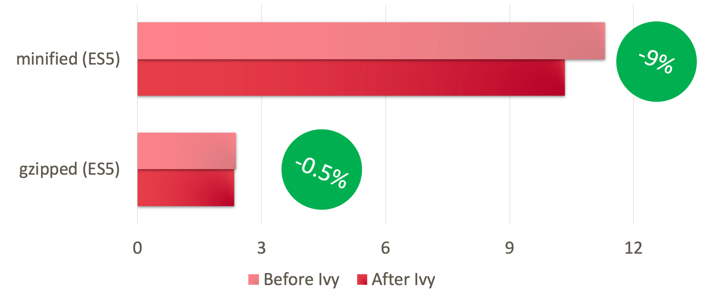
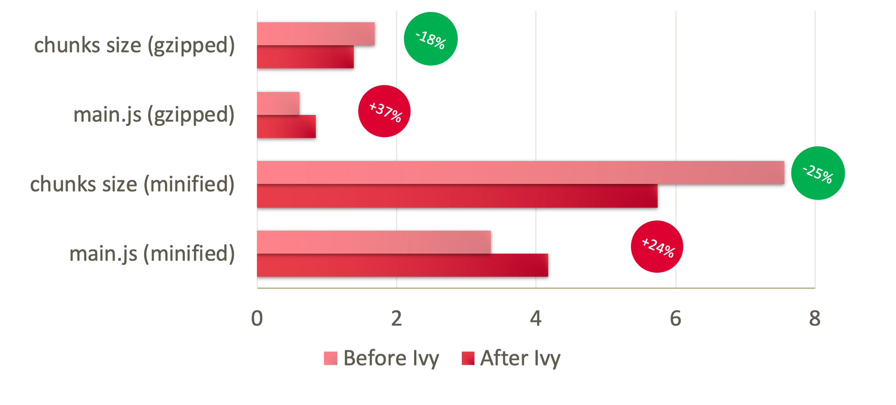
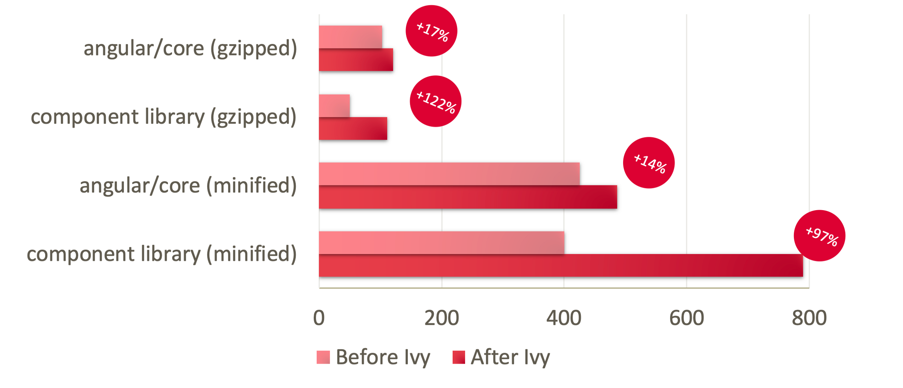
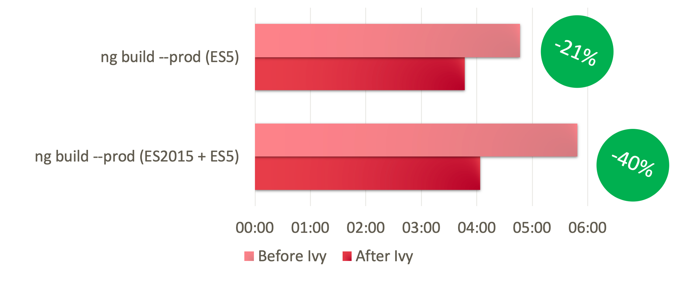
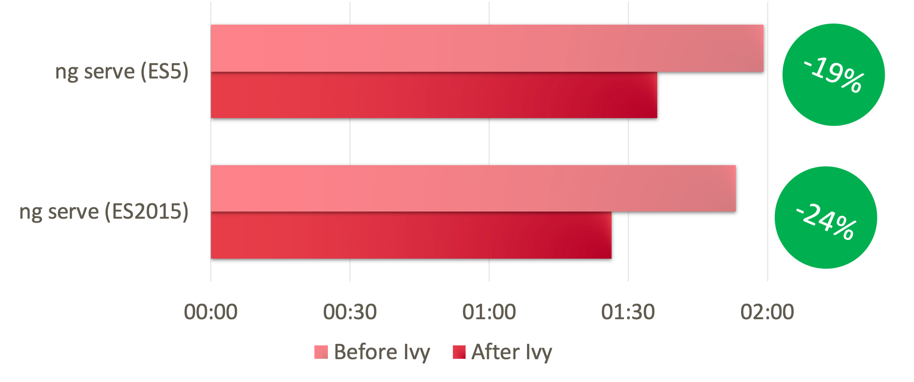
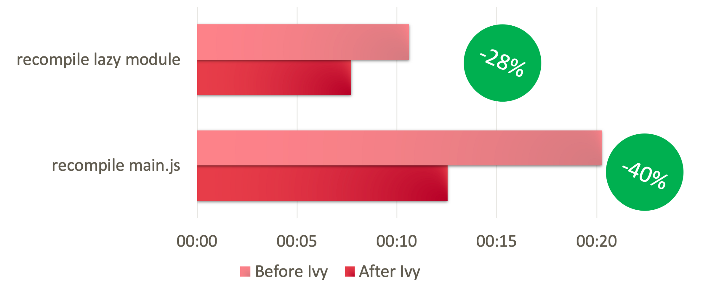
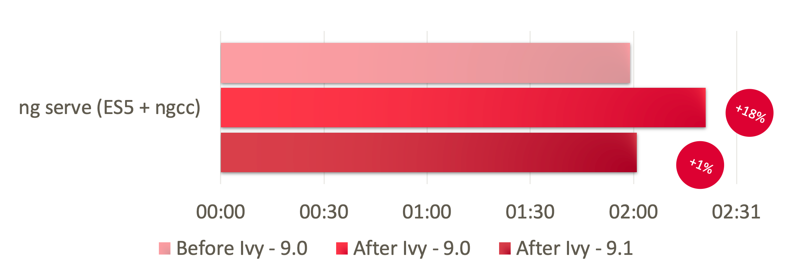

In this article, we’re going to dive into bundle-size and compilation speed insights. We have seen various benchmarks and charts on conferences. What is the real impact on our application?

Discussing how Ivy works is out of our scope. I recommend [inDepth article about its internals](https://indepth.dev/ivy-engine-in-angular-first-in-depth-look-at-compilation-runtime-and-change-detection/), for other changes read official blogposts for [Angular 9](https://blog.angular.io/version-9-of-angular-now-available-project-ivy-has-arrived-23c97b63cfa3) and [Angular 9.1](https://blog.angular.io/version-9-1-of-angular-now-available-typescript-3-8-faster-builds-and-more-eb292f989428).

### Application context

Each application is unique. Hence, Ivy enablement is going to cause different improvements. Because of this, benchmark I created must be spoiled by application we develop. Here are few details about it:

A single [Nx monorepo](https://nx.dev/angular) with two apps: Bigger main product and smaller support app, both sharing codebase. We develop this codebase for 2 years.

- 130k lines of code (TypeScript + HTML)
- 800 components
- 140+ lazy-loaded modules

I conducted tests on Angular 9.0.6 with Ivy: enabled and disabled. I compare ES5 and ES2015 bundles where it makes sense. Bundle size is calculated by a [webpack bundle analyser](https://www.npmjs.com/package/webpack-bundle-analyzer).

At the point of writing, we already use Angular 9.1, I’ll put a note where it makes a difference.

### Bundle size benchmark

Measurements are based on gzipped vs non-gzipped configuration. To make results easier to analyse, I focus on ES5 builds only.

Angular team suggest expected values:

- Small applications: 30% improvement
- Medium applications: 2% improvement
- Big applications: 25–45% improvement

#### Full build size

I’m using full build metric for the general sum of improvements delivered by the new compiler.

<figcaption>Full production bundle size Values are Megabytes.</figcaption>

#### gzipped value does not knock down

Full build metrics does not relief what is going on under the hood. List of files (for us its over 140) splits on main.js file that is loaded as first and 139 lazy loaded modules.

Let’s split comparison:

<figcaption>Comparison of main.js and sum of lazy loaded chunks. Values are Megabytes.</figcaption>

#### 🤯 Why is main.js bigger?

Lazy loaded chunks are purely compiled with Ivy, effecting smaller output of gzipped and minified bundles by 20–30%!

This is good, but what is going on with main.js? It meant to be much smaller because of better tree-shaking of Angular!

Have a look. main.js consist of:

- Angular libraries,
- utility libraries,
- components / services that couldn’t be lazy loaded

Utility libraries have nothing to do with Ivy, the same with Angular Services. What left us: Angular framework and component library.

Let’s go even deeper and compare only those:

<figcaption>Angular library (left), our in-house <a href="https://barista.dynatrace.com/components">barista components library</a>. Values are Kilobytes.</figcaption>

That solves a riddle. For Angular 9, each Angular library — framework itself, component libraries, NgRx — needs to be re-compiled now with ngcc tool to run with Ivy runtime. ngcc re-compiles node\_modules libs with Ivy compiler. This process might make components little bigger.

Other cause of bigger size I noticed is, with Ivy enabled, much less lazy loaded chunks are generated. For Pre-Ivy bundle we had 143 generated JS files, for Ivy its only 37 files — split by only root lazy-loaded modules. More code lands into main.js too.

This could be related to a breaking change described in [Ivy compatibility guide](https://angular.io/guide/ivy-compatibility#payload-size-debugging) to be fixed by libraries we use, we had suggestion applied in place though without effect.

Is it bad? Well, on chart — maybe. But it’s temporary situation. Initial plan for Angular 10 is to work without ngcc. I believe, once migration period is over those values are going to be much smaller. Here is my reasoning:

- Currently libraries are compiled in JIT-mode, then re-compiled with ngcc
- Angular 10: libraries are going to publish code compiled by Ivy with AOT
- Then, we won’t need compatibility layers for components with ngcc
- AOT-compiled output is additional bonus, making libraries even smaller

### Compilation speed benchmark

#### Production build

<figcaption>Production build time in minutes.</figcaption>

Differential loading (ES2015+ES5) build used to be slower for obvious reasons, it needed to generate two packages of the same code. Ivy helps with both builds, saving 1 minute of build time — that’s a nice improvement. Moreover, it reduces gap:

- 4 instead of 6 minutes for differential loading
- 3 minutes 40 seconds instead 4 minutes 45 seconds for regular ES5 build

🎉 20–30% improvement!

#### Development build

<figcaption>Development build time in minutes.</figcaption>

For development build, there is no differential loading. We compile ES2015 or ES5, never both. Here ES2015 is proven to be 10–20s faster.

After enabling Ivy, we see:

- ES2015: 1min 25s instead 1min 55s
- ES5: 1min 40s instead 2min

🎉 20–25% improvement! 30 seconds gained for every build started 😎

#### Recompile time

<figcaption>change re-compilation time (minutes)</figcaption>

Re-compilation time depends heavily on the place you’re editing. Smaller, lazy-loaded modules are re-compiling faster than modules inside main.js.

We’ve already observed significant improvements in recompilation times after upgrade to Angular 8.2 (mostly thanks to TypeScript improvements), but yay! Ivy compiler managed to squeeze times even more.

- Small, lazy-loaded module: 5–7 seconds instead of 10–12s
- Change in HTML in core components: 12–13s instead of 20s

🎉 30–40% improvement! 😲 5s every-change makes a dramatic difference in development experience.

### YES!

Those results are worth waiting for, especially we’re at the process of migration to full Ivy potential, and we can expect further improvements.

**BUT!** I mentioned libraries, those need to be re-compiled with ngcc tool before a build. For us it costs **40–50s for Angular 9.0** and **20–30s for Angular 9.1**

Happily, in Angular 9.1, ngcc is smart enough to run on-demand, not every compilation and not every post-install change.

<figcaption>development build time of first run (minutes)</figcaption>

Overhead is going to be visible only on first run after adding/changing dependencies.

### Unit testing speed

We have a new TestBed implementation that allows to cache component definitions without the need to re-compile every test run. It’s expected to speed-up by 25–50%.

I cannot comment it as we use jest with [preset for angular configuration](https://github.com/thymikee/jest-preset-angular),  
I haven’t seen any difference for our set-up just by enabling/disabling Ivy.

### Closing thoughts

You might get impression that results are not worth upgrade.   
No! Nothing like that. ngcc adds some overhead both size and speed, but:

After having a thought, I’m happy bundle size is just not worse during migration period. We already gained build time benefits.

I’m thankful for ngcc, so library authors can have versions compatible with Angular 8 and Angular 9.

I’m thankful we’re not going to split community into Post-Ivy and Pre-Ivy era, the way Python 2 vs Python 3 or Angular 1 vs Angular 2+ did. 😉

In the next blogpost, I’ll present a few tips on migrating to Angular 9 and 9.1 with a single-file commit. Wait, is it even possible with all breaking changes? Yes! But you need to act smart.

### Bonus: Lesson learned

Don’t expect Ivy project to speed-up much when you have bugs in your build configuration!

The front-end toolset is complex. Even minor dependency might grow your bundle or compilation time. Thus, make sure you’re doing bundle analysis occasionally (preferably, on a regular basis!).

Angular team tries to save every bit of code in runtime, whereas e.g. sass-loader might add megabytes of duplicated CSS just because of a simple mistake in the configuration.

What about your projects? Did you perform similar benchmarks? I’d be happy to hear about your results.

**If you’ve learned something new, please:**

→ [follow me on Twitter (@constjs)](https://twitter.com/constjs) so you won’t miss future posts:

* * *
