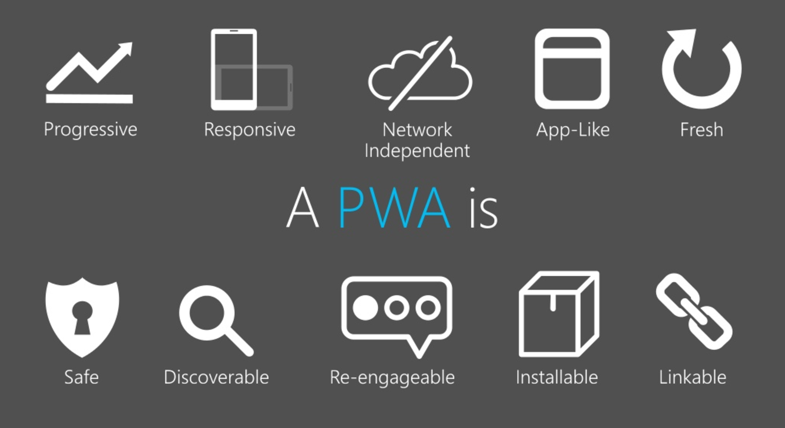

### Notes from [the conference](http://www.js-poland.pl). Based on 20 hand-written pages. Strong or misleading interpretations are all on me.

*TL;DR; No new framework announced, go home kiddo… Oh Wait Nope! Progressive Web Apps happens to be the new hotness.*

## Keynote — Progressive Web Apps

*Christian Heilmann ([video](https://www.youtube.com/watch?v=QOKWDAQSS_w), [slides](https://www.slideshare.net/cheilmann/progressive-web-apps-bringing-the-web-front-and-center), [twitter](https://twitter.com/codepo8))*

*Progressive Web Apps (PWA)* — simply — are just websites built to be more like native apps. It’s not a new concept, but so far we were failing. Lack of native capabilities forced workarounds. Hardware and JS engines were not as fast as today. Everyone had to figure out their own definition of “Web App”.

Consider `PWA` as a set of principles to follow during building an app. Browsers already implement mechanisms that help to achieve them.

“Progressive” comes from progressive enhancement. Once your users have more superpowers, your app should give them more possibilities. Without forgetting rest of users. We’re talking here about network capabilities, offline mode, screen size, budget devices.

### Is it possible to build?

* Native features — see [what web can do today](https://whatwebcando.today/)

* Twitter Lite as great example of `PWA` ([how it’s built](https://blog.twitter.com/engineering/en_us/topics/open-source/2017/how-we-built-twitter-lite.html))

* This trend has a strong support of Google and Microsoft in their stores. Apple seems to ignore it.

## Async Functions Awaiting You

*Tomasz Ducin ([slides](http://slides.com/ducin/async-functions-awaiting-you), [twitter](https://twitter.com/tomasz_ducin))*

Promises and generators already provide the way for representing asynchronous functions in a synchronous manner. async/await* functions* are introduced as the simplification of this concept.

Promises themselves have limitations like being greedy and accessing a value from the previous step only. With complex calculations, you easily fall into hell the same as callbacks.

* async/await will be included in ES2017 ([supported in all major browsers](http://caniuse.com/#feat=async-functions))

* Cannot be used within nested functions

* for-await introduces lazy evaluation on collections, it’s not yet accepted

* TypeScript & Babel supports it already (you need native Promise, might be problem for AngularJS with $q)

* Top-level await is [a footgun](https://gist.github.com/Rich-Harris/0b6f317657f5167663b493c722647221) 🔫.

## Let the dinosaurs finally die out with a little help of a Service Work

*Kacper Sokołowski ([slides](https://speakerdeck.com/kaapa/let-the-dinosaurs-finally-die-out-with-a-little-help-of-a-service-worker), [demo](https://github.com/kaapa-s/service-worker-ancient-demo), [twitter](https://twitter.com/kaapa_s))*

How to implement `PWA`*requirement — Network independence? Cache components necessary to run your application. Well-known options are local storage, cookies, indexedDB and now… service workers.

### Service workers…

* Build for better offline experience

* Acts as proxy between app and Browser Networking

* Can easily intercept any fetch() request ([example from demo](https://github.com/kaapa-s/service-worker-ancient-demo/blob/master/sw.js))

* Works even when user is not on website (can update resources once user goes online)

* Still Working Draft, [not well-supported](https://jakearchibald.github.io/isserviceworkerready/).

This presentation focuses on handling offline state, but very good use case are notifications and background sync.

*Service worker intercepts calls to server and restores data from cache if needed*

## React Native — Success case study

*Gabor Wnuk ([slides](https://docs.google.com/presentation/d/16hGQaLER58QpEeXCJYCJup9qaGQDilcIzZ8wFK_Nh00), [twitter](https://twitter.com/gaborwnuk))*

A story behind [*Pudelek.pl app](https://play.google.com/store/apps/details?id=pl.o2.android.pudelek&hl=pl)*: improving legacy project on three platforms (iOS, Android, Web) without rewriting everything from scratch. How? React Native can be built on top of your existing application as a dependency.

There is no WebView. Means no HTML or CSS. Everything is compiled to native components by series of compilation steps. When you use fetch().then() API, it’s converted to appropriate HTTP Client in Java or iOS.

They encouraged native developers to write [JavaScript](https://hackernoon.com/tagged/javascript), however that didn’t fit well. Technologically they used Flow type to keep code more familiar to Kotlin and Swift.

*Business logic reused, views remain platform-specific*

The success of *Pudelek app* is considered in following aspects:

* For developers — shared codebase means one common knowledge, hot reloading improved development flow (4s vs 4min of compilation)
* For business — 30% revenue boots, faster development
* For users — Maintained 60fps even on weak devices, fewer crash reports (From 97% to 98%).

### Ending note

Native developers are still needed. Deployments, platform-specific views and things that React Native doesn’t support. Productivity is better but not like 3 times better.

## Keep your skills sharp! Developer career in rapidly changing technology world

*Michał Nowak ([twitter](https://twitter.com/wicherrr))*

Michał reminds about distinguishing important things in Software Developer career. He points that with a good chance, he can guess the content of CV based on birth date of an applicant.

### Uncertainty of market and ourselves

10 years ago 2007, Web Developers were using flash. You know the story. Can you predict what will happen in 2027?

That being said, you can’t predict how your core life values will evolve. Having son? Not yet? Enjoy your time then.

### Traps

* Comfort Zone — It’s cliche, but still — everyone tends to fall into it. Think if you want to be in this project in next 2 years? If no, now it’s the best time to change.

* Time waste — 10 years of experience, 4 positions in CV in which every includes “jQuery + WordPress”, only company name and level changes from Junior to Senior.

* Expenses correlated with salary — Money gives you freedom and takes it back once you get used to it. Think of it if you would want to become musician someday. Avoid increasing expenses together with salary. Lowering lifestyle is not easy.

### Career Compass

* Use fun and challenges as compass of your career.

* Don’t take that full-stack job from your boss if you’re truly back-end driven.

* We learn most if we fall in projects that overwhelm us. It’s like we’re beginners again.

## The Mobile Web Second Edition: First-Class Citizen on Your Device Now

*Maxim Salnikov ([slides](http://slides.com/webmax/mobileweb-jspoland#/), [twitter](https://twitter.com/webmaxru))*

How to answer a question: *We need a mobile app?*

Maxim showed lots of statistics how mobile web is growing and overcoming desktop in lots of different measures. It is correlated with demand for mobile app developers also.

*As Web developers, we had multiple tries to involve in mobile world — but failed as HTML5 apps looked crappy and were unbelievably slow*

Progressive Web Apps are green octagon and meant to be “the next big thing”, I was especially interested in traits for not only users but business.

* [Google plans to integrate *PWA* within Play Store](https://techcrunch.com/2017/02/02/google-will-soon-integrate-progressive-web-apps-deeper-into-android/). *PWA *can be also distributed within search, by links, etc.

* There are multiple statistics showing that users aren’t eager to discover new apps often and it’s very expensive to acquire them via App Stores.

* It lowers entrance barrier for your users to use your app — don’t have to install it, nor update every single time you fix the bug.

If it’s framework agnostic, how to actually implement it? Look for inspiration at [*HackerNews PWA](https://hnpwa.com/)* — A spiritual successor to *TodoMVC*.

What about other popular options? I highly recommend [slides](http://slides.com/webmax/mobileweb-jspoland). Maxim covered in great details differences between Ionic, NativeScript, React Native and *PWA* ideology.

## RxJS all things!

*Simona Cotin ([twitter](https://twitter.com/simona_cotin))*

### **Most important async components of the web:**

* Dom Events — Multiple values

* AJAX — Single value

* Animations — Cancellable

* Web sockets — Multiple values.

### Why and how people learn RxJS?

* Promises are great but fit only to AJAX from the list above. We need more consistent way of handling with all those async stuff

* Consider RxJS as Lodash, but for events.

### Challenges

* Debugging is not very convenient, you have to use special operator to print state: .do(x => console.log(x)).

* Thinking reactive and understanding API — there is a serious learning curve, mainly because API is hard to understand and documentation is not the best possible.

* There is much hope in RxJS 5.

## DevTools Deep Dive

*Alex Lakatos([video](https://www.youtube.com/watch?v=mwfYmo8GhoU), [twitter](https://twitter.com/lakatos88))*

I haven’t taken notes here. Alex has given a demo on how Firefox DevTools tries to catch up Chrome. Starting with simple tricks in Inspector and [Network ](https://hackernoon.com/tagged/network)tab, configuration to more advanced performance analysis.

Although I wasn’t convinced to use Fx DevTools over Chrome’s, I strongly support Firefox in that competition.

## Angular is on Fire(base)!

*Shmuela Jacobs ([slides](https://www.slideshare.net/CodemotionTLV/angular-is-one-firebase-shmuela-jacobs), [twitter](https://twitter.com/shmuelaj))*

* Firebase as service offers you backend solution for authentication, database (stored as JSON documents), file storage, analytic and more.

* Lately introduced “cloud functions” which allows writing NodeJS code over things not supported in SDK, e.g. API integration, night jobs. This concept feels similar to the idea of micro-services and server-less architecture.

* It’s heavily integrated with Angular2+, database queries return Observable.

* You can set constraints on a database (like authentication or validation) however, you do that in strings which are kind of strange.

## JWT, WTF?

*Phil Nash ([slides](https://speakerdeck.com/philnash/jwt-wtf-at-js-poland), [twitter](https://twitter.com/philnash))*

* There are lots of abbreviations around the subject of JSON Web Token, but there is no special magic behind them.

* It’s not magic string, but simply encoded JSON object with Base 64

* It’s encoded, not encrypted. It’s easily converted into human-readable form

* Ignore spec clause saying you should validate key using the algorithm from JWT. A client can send you “none” algorithm. Validate key with expected algorithm

* Where should token be stored?
Cookies are preferred, but remember to secure from CSRF. Local storage is vulnerable to XSS attacks and forces using JavaScript (and setting additional header)

At this point, conference ended.
